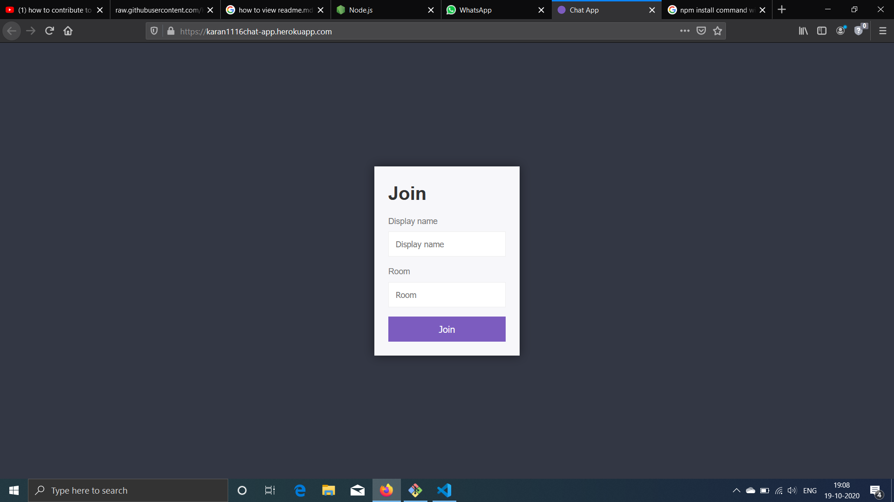
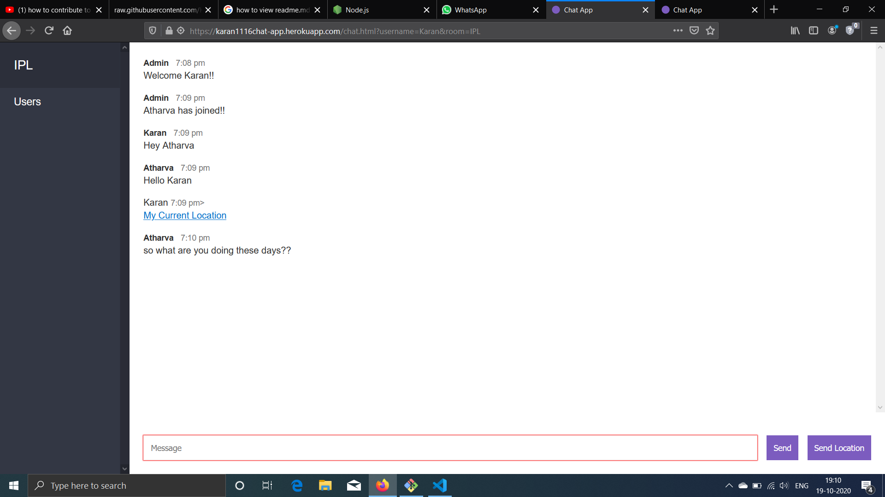

# REALTIME CHATAPP

Realtime chatapp allows random users to chat together. It is based on socket programming which gives us the functionality of realtime. It also has a feature to block profane language. It's server is based on express. It has a eye catching UI and fast performance.

## Sections

- [Installation](#Installation)
- [Screenshots](#Screenshots)
- [Author](#Author)
- [Security](#Security)
- [License](#License)

## Installation 

- [NodeJs 12.0.0 or higher](https://nodejs.org/en/) is required to use it.
- [Socket.io framework 2.3.0](https://www.npmjs.com/package/socket.io) is required to use it.
- [ExpressJs framework for apache server and my sql](https://expressjs.com) is required to use it.
- [bad-words.js is required to avoid profane language](https://www.npmjs.com/package/bad-words) is required to use it.

Installation of Socket.IO is recommended to be done via [npm](https://www.npmjs.com/) by running:

	npm install socket.io@2.3.0

Installation of Express.Js also recommended to be done via [npm](https://www.npmjs.com/) by running:

    npm install express@4.17.1

Installation of bad-words.js also recommended to be done via [npm](https://www.npmjs.com/) by running:

    npm install bad-words@3.0.3    

## Screenshots

 | 

## Author

* **Karan Parwani** - *Initial work* - [Repo](https://github.com/KaranParwani1116?tab=repositories)

## Security

If you discover any security related issues, please email karanparwani.parwani102@gmail.com instead of using the issue tracker.    

## License

This project is licensed under the MIT License - see the [LICENSE.md](https://github.com/KaranParwani1116/ChatApp-Node.js/blob/master/LICENSE.mds) file for details